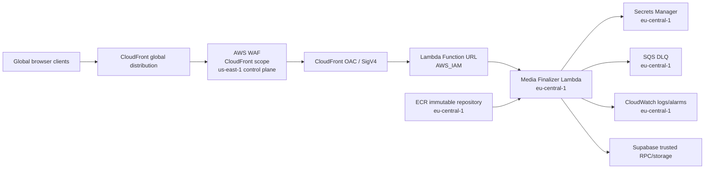

# TIGER Media Finalizer — Frankfurt Regional Runtime + Global Edge Design

Date: 2026-08-27
Base commit: `73f4ce66f313a87785d712593e248f4a418a36d0`
Implementation branch: `feat/tiger-media-frankfurt-global-edge-20260827`
Status: owner-approved architecture direction; specification checkpoint; no AWS resources created by this document

## 1. Decision

TIGER Media Finalizer adopts a split AWS topology optimized for a global platform:

- **Regional runtime authority:** `eu-central-1` (Europe — Frankfurt).
- **Global delivery authority:** Amazon CloudFront.
- **CloudFront-scope AWS WAF authority:** `us-east-1` only where AWS requires CloudFront-scoped WAF resources to be managed.

`us-east-1` is not the default runtime region for Lambda, ECR, Secrets Manager, SQS, CloudWatch, or the media-finalizer regional stack.

This design supersedes every unexecuted bootstrap instruction that would have created the media runtime in `us-east-1`.

## 2. Goals

The design must:

1. keep TIGER globally reachable through CloudFront;
2. place the first media compute/runtime authority in Frankfurt;
3. separate regional runtime resources from global edge/WAF resources;
4. preserve GitHub OIDC with zero standing AWS access keys;
5. preserve immutable OCI build identity, scan, SBOM, attestations, and cryptographic release passport requirements;
6. support a correct first Production bootstrap when no prior media stack/version exists;
7. use a true 10% weighted canary only when a real stable predecessor exists;
8. remain fail-closed if any regional, edge, identity, scan, probe, alarm, change-set, or evidence gate fails;
9. avoid fabricated baselines, fake endpoints, mutable image authority, and compatibility fallback paths.

## 3. Non-goals

This phase does not add active-active multi-region Lambda, global database replication, Route 53 latency routing, or a second runtime region. TIGER remains globally distributed at the edge while media compute starts in Frankfurt. Additional runtime regions require measured demand and a separate reviewed design.

This phase does not create AWS resources directly from a developer workstation, does not create access keys, and does not widen the existing identity-only `TIGER-VVIP-GitHub-ProductionDeploy` role merely to unblock a build.

## 4. Topology

CloudFront is the only public Production path. The direct Lambda Function URL remains `AWS_IAM` and must reject bypass traffic.

## 5. CloudFormation authority split

The merged single-stack media template is no longer the target Production deployment authority. Implementation must split it into independently valid regional and edge stacks.

### 5.1 Frankfurt regional stack

Region: `eu-central-1`.

Owns:

- ECR repository or an explicitly imported/bootstrap repository with converged lifecycle authority;
- Lambda runtime IAM role;
- Lambda Function URL with `AWS_IAM`;
- Lambda container function by immutable OCI digest;
- published Lambda versions;
- stable `live` alias;
- encrypted SQS dead-letter queue;
- Secrets Manager read permission for exactly one dedicated Supabase secret reference;
- CloudWatch log group and named alarms;
- regional permissions required for CloudFront OAC origin invocation.

Runtime settings remain:

- Node.js 24 container;
- memory `2048 MB`;
- timeout `30 s`;
- reserved concurrency `8`;
- SQS managed encryption;
- DLQ retention `1209600` seconds (14 days).

### 5.2 Global edge stack

Control/deployment region: `us-east-1` for CloudFront-scope WAF compatibility.

Owns:

- CloudFront distribution;
- CloudFront Origin Access Control for Lambda Function URL SigV4 signing;
- no-cache media-finalizer behavior;
- explicit allowed/forwarded methods and headers;
- AWS WAF Web ACL with `CLOUDFRONT` scope;
- AWS managed WAF baseline rules and bounded rate protection;
- edge outputs required for runtime verification, including the real HTTPS media-finalizer CloudFront URL.

The edge stack consumes only non-secret regional identifiers/outputs needed to bind the CloudFront origin. It must never receive Supabase credentials, Clerk session tokens, media capabilities, raw media, signed object URLs, or application secret values.

## 6. Canonical region contract

The protected GitHub/environment configuration becomes:

- `TIGER_AWS_REGION=eu-central-1`
- `TIGER_MEDIA_ECR_REPOSITORY=tiger-media-finalizer`
- `TIGER_MEDIA_BUILD_ROLE_ARN=arn:aws:iam::211579682376:role/TIGER-VVIP-GitHub-MediaBuild`

Edge workflows use an explicit independent region value for `us-east-1`. They must not overload `TIGER_AWS_REGION` to mean both runtime and WAF control regions.

Any test, workflow, policy, or bootstrap path that assumes the media runtime itself is in `us-east-1` must fail until corrected.

## 7. IAM and GitHub OIDC

### 7.1 Existing identity-only role

`TIGER-VVIP-GitHub-ProductionDeploy` remains unchanged until a separate least-privilege deployment authority is reviewed. Its current zero-policy state is intentional evidence from the earlier OIDC identity proof and is not widened as a shortcut.

### 7.2 Dedicated Media Build role

Create `TIGER-VVIP-GitHub-MediaBuild` through a one-time controlled bootstrap.

Trust requirements:

- existing GitHub OIDC provider only;
- account `211579682376`;
- repository ID `1273805565`;
- repository owner ID `294954557`;
- exact repository `vvipautoparts-blip/TIGER-VVIP`;
- protected GitHub Environment `media-build`;
- `refs/heads/main` only;
- audience `sts.amazonaws.com`;
- bounded session duration.

Permission requirements:

- `ecr:GetAuthorizationToken` where AWS requires account-scope authorization;
- layer upload/download, image put/describe, repository describe, and image-scan read only for `arn:aws:ecr:eu-central-1:211579682376:repository/tiger-media-finalizer`;
- no IAM mutation;
- no CloudFormation mutation;
- no Lambda mutation;
- no Secrets Manager secret-value read;
- no wildcard administrative policy.

No standing AWS credentials are created or stored in GitHub.

## 8. ECR bootstrap and lifecycle

The first AWS resource required by the sealed build is an immutable ECR repository in Frankfurt:

`tiger-media-finalizer`

Required properties:

- region `eu-central-1`;
- immutable image tags;
- scan on push enabled;
- encryption enabled;
- project/purpose tags;
- no public repository policy.

The sealed build records the OCI manifest digest and never promotes a mutable tag as deployment authority.

After the regional CloudFormation stack becomes authoritative, repository lifecycle ownership must converge intentionally. The implementation must not leave two independent authorities that can both recreate or mutate the same ECR repository.

## 9. First Production release: Dark Bootstrap

Current AWS evidence shows there is no media-finalizer CloudFormation stack and no previous deployed Lambda version. A real 90/10 weighted canary therefore has no legitimate stable version to receive 90% of traffic.

The first Production release uses **Dark Bootstrap**, not a fabricated baseline.

Sequence:

1. sealed build succeeds on the exact current `main` SHA;
2. OCI digest, ECR scan, CycloneDX 1.7 SBOM, provenance, SBOM attestation, and release passport are verified;
3. Frankfurt regional stack is created for the first time;
4. the first immutable Lambda version is published;
5. global edge stack is created and bound to the Frankfurt Function URL through OAC;
6. the endpoint remains absent from public TIGER browser runtime configuration;
7. protected positive/negative runtime and abuse probes execute through the real CloudFront endpoint;
8. direct Function URL bypass is required to fail;
9. named CloudWatch alarms are required to be healthy;
10. the first verified version becomes the stable `live` baseline;
11. only after all evidence is GREEN may the real CloudFront endpoint become eligible for `TIGER_MEDIA_FINALIZER_URL` convergence.

Dark Bootstrap is a first-release bootstrap mode only. Evidence must name it `dark-bootstrap`; it must never be represented as a 10% canary.

## 10. Subsequent releases: true 10% canary

Once a verified stable `live` version exists, every later release follows the weighted canary path:

- prior stable version: 90%;
- candidate immutable version: 10%;
- probes execute through CloudFront;
- alarm gate must remain GREEN;
- promotion removes additional weights and makes the candidate 100% stable;
- failure restores the prior stable alias/version and, when necessary, the prior regional/edge stack state.

The deployment workflow must determine the deployment mode from live AWS evidence:

- no prior stable numeric version -> `dark-bootstrap`;
- prior stable numeric version exists -> `canary-10`.

It must never create a dummy version or synthetic baseline merely to satisfy a canary shape.

## 11. Deployment workflow architecture

The current deployment workflow assumes an existing stack and uses `UPDATE` change sets only. It must be redesigned to support both first deployment and later updates.

Lifecycle:

1. **Sealed build** — operates against Frankfurt ECR only; build-once, scan, SBOM, attest, verify, passport.
2. **Regional deploy stage** — `eu-central-1`; CloudFormation `CREATE` when the regional stack is absent, `UPDATE` when present; immutable image digest only.
3. **Edge deploy stage** — `us-east-1`; `CREATE` when the edge stack is absent, `UPDATE` when present; CloudFront/WAF/OAC binding to the regional origin.
4. **Runtime verification stage** — CloudFront positive/negative probes plus direct Function URL denial proof.
5. **Promotion/rollback stage** — Dark Bootstrap stabilization for first release or true weighted canary for later releases.

Every CloudFormation mutation requires pinned `cfn-lint` and CloudFormation Guard validation before change-set creation. Change-set identity and reviewed contents become release evidence.

## 12. First-create fail-closed rules

For first deployment:

- stack absence must be positively established before `CREATE`;
- an unexpected pre-existing stack with mismatched ownership/tags/contract is a hard stop;
- CloudFormation create failures do not fall back to manual console mutation;
- edge creation does not proceed until the regional stack exposes a verified origin identifier;
- public browser configuration remains unchanged throughout Dark Bootstrap;
- partial bootstrap is not Production-ready.

## 13. Secret and identity boundaries

The region split must not change application security invariants:

- Clerk JWT is independently verified in Lambda;
- exact-body `x-amz-content-sha256` remains mandatory;
- one-time media capability remains an independent authorization lock;
- JWT `sub` must equal the trusted database owner subject;
- Supabase privileged credential comes only from AWS Secrets Manager;
- CloudFront/WAF/CORS never substitute for end-user identity;
- direct Lambda Function URL access never becomes a public fallback.

## 14. Cryptographic Release Passport additions

The media release passport must additionally record:

- runtime region `eu-central-1`;
- edge control region `us-east-1`;
- ECR repository ARN/URI and OCI digest;
- regional stack identity and change-set identity;
- edge stack identity and change-set identity;
- CloudFront distribution identity;
- WAF Web ACL identity;
- deployed Lambda version;
- stable alias target;
- deployment mode: `dark-bootstrap` or `canary-10`;
- runtime probe evidence digest;
- alarm-state evidence digest;
- rollback evidence when exercised.

Evidence contains identifiers, hashes, bounded statuses, and timings only. It must never contain secret values, JWTs, capability tokens, raw media, or signed object URLs.

## 15. Testing requirements

Implementation starts with failing contracts that require:

- runtime region is Frankfurt;
- edge/WAF region is independently `us-east-1`;
- regional and edge CloudFormation templates are separate;
- regional template contains no CloudFront-scope WAF Web ACL;
- edge template contains no Lambda runtime, ECR repository, SQS queue, or Secrets Manager secret permission;
- build workflow resolves Frankfurt ECR only;
- first deploy supports CloudFormation `CREATE` without requiring a prior stack/version;
- first deploy cannot claim `canary-10`;
- later deploy requires a real previous stable numeric version before weighted canary;
- direct Function URL bypass remains denied;
- rollback never re-enables a legacy unauthenticated runtime path;
- region identities appear in release evidence;
- no static AWS access key path is introduced.

Existing Media Finalizer security, DB, container, Infra Rehearsal, Zero-Residue, Quality Gate, CodeQL, Dependency Review, CleanGuard, and Project Control gates remain mandatory.

## 16. Bootstrap security discipline

Root is allowed only for the minimum bootstrap actions that cannot yet be performed through the established administrative path. No root access key is created.

Preferred bootstrap sequence:

1. create/verify the Frankfurt immutable ECR repository;
2. create the dedicated GitHub OIDC Media Build role with exact trust conditions;
3. attach only the bounded ECR build policy;
4. configure the protected GitHub `media-build` Environment variables;
5. verify Sealed Build succeeds through OIDC;
6. sign out from root;
7. use separately reviewed least-privilege deployment/service roles for CloudFormation Production deployment.

The existing zero-policy identity-proof role is preserved unless a later reviewed design explicitly replaces or repurposes it.

## 17. Migration discipline

No Media Finalizer ECR repository or CloudFormation stack has been created in `us-east-1`, so there is no runtime data migration or destructive cleanup required there.

Implementation must not create a compatibility fallback to the merged single-stack deployment model. Once the split architecture is verified and merged, there is exactly one current deployment authority per resource domain; old combined definitions remain historical evidence only.

No Production resource deletion is authorized by this design.

## 18. Operational evolution for a global platform

Frankfurt is the first regional compute authority, not a claim that all TIGER users are European. CloudFront provides global edge reach while preserving one deterministic origin authority for the first release.

A second runtime region is considered only after measured requirements justify it, such as sustained latency, regulatory/data-residency constraints, regional failure objectives, or material traffic concentration. A future multi-region design must define state authority, secret replication, ECR/image replication, failover routing, observability aggregation, and deterministic release identity before activation.

This prevents premature distributed-system complexity while keeping the architecture ready to evolve.

## 19. Success criteria

The architecture is considered implemented only when all of the following are true on the exact current release authority:

1. repository contracts prove Frankfurt regional / global edge separation;
2. all exact-head CI gates are GREEN;
3. ECR exists in `eu-central-1` with immutable/scan/encryption properties;
4. Media Build GitHub OIDC role is independently least-privileged;
5. Sealed Build succeeds and produces a verified immutable OCI digest, scan, CycloneDX 1.7 SBOM, attestations, and passport;
6. first Production deployment can create absent stacks through reviewed change sets;
7. Dark Bootstrap probes and alarms are GREEN through the real CloudFront endpoint;
8. direct Function URL bypass is denied;
9. first stable `live` version is established without public browser activation during verification;
10. later release logic proves a true 90/10 canary only when a prior stable version exists;
11. rollback evidence is fail-closed;
12. `TIGER_MEDIA_FINALIZER_URL` is set only to the verified real CloudFront endpoint after successful bootstrap evidence;
13. no statement of Production readiness is made before actual AWS runtime evidence exists.

## 20. Current stop boundary

This specification changes repository design authority only. It does not itself authorize an AWS mutation.

The next implementation phase is test-first repository work on the isolated branch, followed by exact-head CI and protected review. AWS bootstrap and Production deployment occur only after the corresponding implementation gates are GREEN and the required live-provider prerequisites are explicitly verified.
