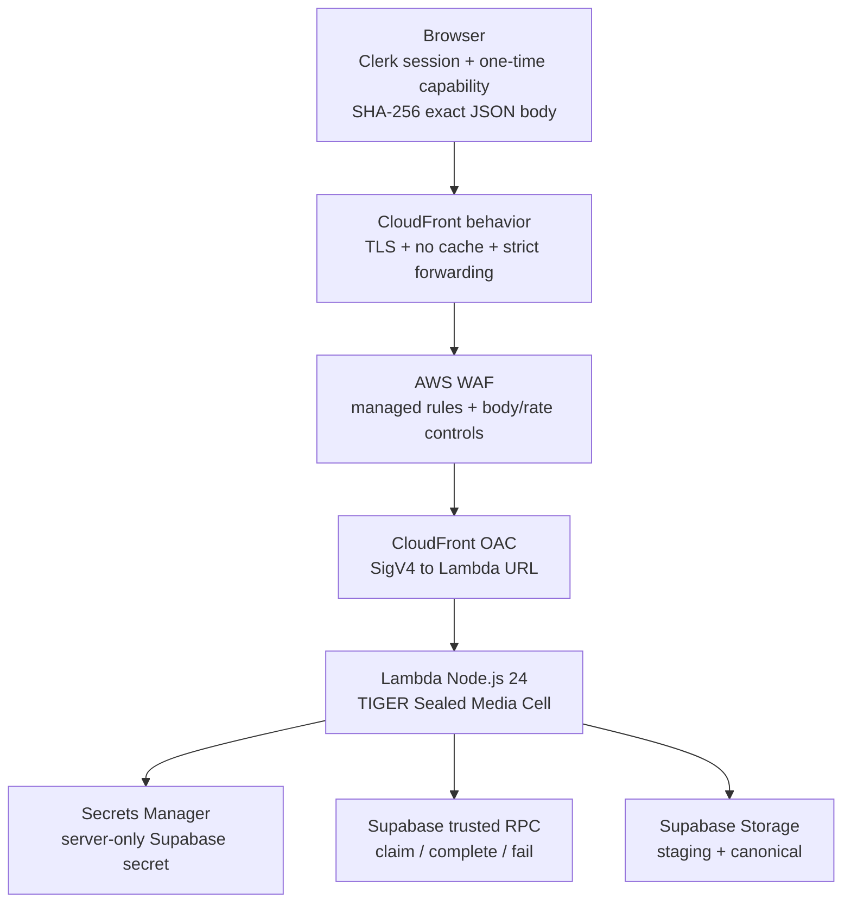

# TIGER Sealed Media Cell 2026 — Hardened Production Design

Date: 2026-08-27
Baseline commit: `c984167e824a54d82b5b5fe4cb295eba9c40cc49`
Baseline tree: `8ce042b5f7f25489ff8bfe4c4412a3a8b6b267f6`
Implementation branch: `feat/tiger-sealed-media-cell-2026-20260827-r2`
Status: architecture baseline owner-approved; repository-specific implementation design pending owner review

## 1. Outcome

TIGER Sealed Media Cell 2026 turns the existing marketplace media finalizer into a fail-closed, identity-bound, content-addressed production cell. It keeps the existing browser-to-Supabase ownership model and one-time media-finalization capability, but adds an independent authenticated server boundary, deterministic request hashing, AWS origin authentication, immutable container delivery, isolated secrets, verifiable supply-chain evidence, canary promotion, and runtime abuse tests.

No AWS resource is created and no Production workflow is rerun merely by landing this specification. Infrastructure creation and Production promotion remain blocked until the implementation plan, tests, protected gates, and owner approvals required by this design are complete.

## 2. Existing repository baseline

The current repository already contains useful security foundations that must be preserved:

- `scripts/runtime/vvip-marketplace-repository.js` requests a short-lived one-time finalization token from `vvip_marketplace_request_media_finalization`, then POSTs `{ mediaId, finalizationToken }` to the configured finalizer URL.
- `supabase/migrations/20260816090001_sovereign_media_finalization.sql` binds jobs to `media_id` and `owner_subject`, stores only a SHA-256 token hash, expires capabilities, leases processing, limits attempts, and blocks publication unless media is canonical.
- `services/media-finalizer/src/handler.js` validates source MIME/size, hashes source and canonical bytes, re-decodes/re-encodes with Sharp, uses content-addressed canonical paths, and records canonical evidence through trusted RPCs.
- `.github/workflows/production-release-artifact.yml` already verifies exact source SHA/tree, builds public bytes once, emits deterministic evidence, creates attestations, verifies them, and preserves a sealed artifact.

The hardened cell corrects the following known gaps instead of discarding those foundations:

1. Browser finalizer requests currently contain neither a Clerk session JWT nor `x-amz-content-sha256`.
2. Finalizer authorization currently relies on `Origin` allowlisting plus the one-time capability; `Origin`/CORS is not authentication.
3. The finalizer currently reads `SUPABASE_SERVICE_ROLE_KEY` directly and sends it as both `apikey` and `Authorization: Bearer`; the target design uses a server-only `sb_secret_*` credential retrieved from Secrets Manager and sent as `apikey` only where supported by the service contract.
4. Source downloads are materialized as an unrestricted `arrayBuffer()` before the expected-size comparison. The hardened implementation must enforce bounded transfer and deadline controls before unbounded accumulation.
5. `services/media-finalizer/package.json` pins Sharp `0.35.0`, has no committed lockfile in the service directory, and the Dockerfile runs `npm install`.
6. `services/media-finalizer/Dockerfile` references `public.ecr.aws/lambda/nodejs:24` by mutable tag rather than an approved digest.
7. The current public release workflow uses Node 22 for its web release build. This is not automatically wrong for the existing web pipeline, but the media finalizer build and tests must execute with the service-declared Node 24 production runtime and must not silently inherit Node 22 assumptions.

## 3. Security invariants

The following are release-blocking invariants.

### 3.1 Three independent authorization locks

A finalization request succeeds only when all three locks pass:

1. **AWS origin lock** — CloudFront reaches the Lambda Function URL only through Origin Access Control (OAC) with Lambda Function URL auth type `AWS_IAM`.
2. **User identity lock** — Lambda validates a short-lived Clerk JWT independently of CORS or Supabase. Validation is fail-closed for signature, allowed algorithm, issuer, audience, authorized party, expiration, not-before, and required subject.
3. **Media capability lock** — the existing one-time finalization token is claimed atomically through the trusted Supabase RPC and remains bound to the media row, owner subject, expiry, lease, and attempt budget.

The Clerk `sub` must equal the owner subject returned by the trusted claim. A valid capability for a different identity is rejected. Neither a valid JWT alone nor a valid one-time capability alone is sufficient.

### 3.2 Request integrity

For every browser `POST`:

- The browser serializes the exact JSON request body once.
- Web Crypto calculates SHA-256 over the exact UTF-8 bytes sent on the wire.
- The lowercase hexadecimal digest is sent as `x-amz-content-sha256`.
- The Clerk session JWT is sent in `X-Tiger-Session`, not in the AWS `Authorization` header.
- CloudFront forwards only the explicitly required request headers and disables caching for this behavior.
- Lambda recomputes the body digest using the received bytes and rejects mismatch before claiming a job.
- Request method, content type, body length, JSON shape, duplicate/unknown security-sensitive fields, and identifier formats are bounded and validated before downstream access.

The body hash is transport/request-integrity evidence; it does not replace identity or the one-time capability.

## 4. Request flow and trust boundaries

Trust boundaries:

- The browser is untrusted even after login.
- CloudFront/WAF is an internet edge control, not application identity.
- OAC authenticates the CloudFront-to-Lambda origin path, not the end user.
- Lambda is the only component allowed to convert staged media into canonical evidence.
- The Supabase server secret never enters browser config, GitHub source, workflow logs, build artifacts, Docker layers, or Lambda environment plaintext.

## 5. Browser contract

`finalizeMediaRow()` will be changed under test so it:

1. obtains the existing one-time capability only after the current authenticated owner is known;
2. obtains a fresh Clerk session token through the project auth adapter rather than reading an arbitrary global string;
3. constructs a minimal object `{ mediaId, finalizationToken }`;
4. serializes it exactly once;
5. computes SHA-256 over that serialized byte sequence with Web Crypto;
6. sends `POST` with `content-type: application/json`, `accept: application/json`, `x-amz-content-sha256`, and `X-Tiger-Session`;
7. uses `credentials: omit`, `cache: no-store`, and `referrerPolicy: no-referrer`;
8. never logs JWTs, capability tokens, body contents, signed URLs, or secrets.

A missing crypto implementation, missing session token, unsupported finalizer URL, body-hash failure, or auth failure is terminal for that operation. There is no insecure fallback to the current unauthenticated request shape.

## 6. Lambda application contract

The finalizer remains a small Node.js 24 service under `services/media-finalizer/`, but is split into testable responsibilities rather than growing a monolithic handler:

- request parsing and exact-body digest verification;
- Clerk JWT/JWKS verification with bounded key caching and issuer/audience/authorized-party policy;
- secret retrieval and in-process cache with explicit refresh/rotation behavior;
- bounded Supabase REST/RPC client;
- bounded storage download/upload client;
- media canonicalization policy;
- listing/proof orchestration;
- redacted structured observability;
- stable safe error mapping.

The handler returns generic public error codes. Internal exceptions, Supabase responses, JWT contents, object paths, capability tokens, secrets, and stack traces are not returned to clients.

### 6.1 JWT policy

Production configuration must provide explicit values for:

- Clerk issuer;
- audience expected by this service;
- allowed `authorizedParties`/`azp` origins or application identifiers as supported by the Clerk token contract;
- allowed signing algorithm(s);
- JWKS source/issuer metadata.

JWT verification must reject algorithm confusion, unsigned tokens, unknown key IDs after bounded refresh, expired/not-yet-valid tokens, missing subject, issuer mismatch, audience mismatch, and authorized-party mismatch. Clock skew is small, explicit, and tested.

### 6.2 One-time capability and replay

The existing database job/token model remains authoritative. The hardened implementation adds identity equality before accepting the claim result. A token is never persisted in plaintext by the service and is never logged.

Replay defenses:

- expired jobs fail;
- active processing leases prevent concurrent duplicate workers;
- completion is terminal;
- attempts remain bounded;
- the claimed owner must equal JWT `sub`;
- request body hash must match;
- canonical object path is content-addressed and non-upserting.

## 7. Bounded media ingestion and SSRF posture

The service does not accept arbitrary source URLs from the browser. It downloads only the storage object path returned by the trusted database claim, from a configured Supabase project origin. This removes the general-purpose URL-fetcher SSRF class.

The storage client must additionally enforce:

- fixed HTTPS Supabase base origin from secret/config, with no per-request host override;
- fetch abort deadline;
- expected compressed byte-size ceiling before and during transfer;
- rejection when `Content-Length`, when present, exceeds policy or contradicts the trusted claim;
- streaming/bounded accumulation so a malicious or broken upstream cannot force unbounded memory growth;
- redirect policy that cannot escape the approved origin;
- MIME agreement among trusted row, response header when present, strict container detection, and decoded metadata.

No proxy URL, user-controlled host, redirect chain, data URL, local-network address, or arbitrary scheme is accepted.

## 8. Canonical image policy

The current strict JPEG/WebP policy remains the base. Server processing must:

- reject unknown, truncated, polyglot/ambiguous, animated, or MIME-mismatched input;
- cap compressed bytes and decoded pixels before expensive output allocation;
- decode with Sharp/libvips under bounded pixels and processing deadline;
- normalize orientation;
- convert to sRGB;
- strip source metadata by constructing a new encoded output without metadata preservation;
- emit only approved JPEG/WebP parameters;
- revalidate the output container and decoded dimensions;
- hash both source and canonical bytes with SHA-256;
- write canonical objects to a digest-derived immutable path with no upsert;
- complete the database record only after canonical upload succeeds.

If upload succeeds but database completion fails, recovery must be idempotent and content-addressed; cleanup must never delete an object that another completed record legitimately references.

## 9. Secrets

The media cell uses AWS Secrets Manager as the only source for server-side Supabase privileged credentials.

Rules:

- secret value is a dedicated `sb_secret_*` credential for this service where supported by the configured Supabase project;
- Lambda receives only a secret ARN/name reference and permission to read that one secret version scope;
- no secret value is placed in CloudFormation parameters, outputs, GitHub variables, repository files, Docker build args, image labels, logs, or release evidence;
- secret is cached in memory for a bounded interval and refreshed after auth failure or version change without exposing the prior value;
- rotation procedure is tested and supports overlap where the provider permits it;
- code does not synthesize `Authorization: Bearer <sb_secret>` unless an explicitly documented Supabase endpoint contract requires it. `apikey` is the default privileged-key header.

## 10. AWS infrastructure

CloudFormation is the sole production infrastructure definition for this cell. Manual console drift is not an accepted deployment path after bootstrap.

Logical resources include:

- ECR repository with immutable tags and enhanced scanning;
- Lambda execution role with least-privilege logging and one-secret read permission;
- Lambda container function, Node.js 24-compatible image, reserved safety limits, timeout/memory/ephemeral-storage values set from measured tests;
- Lambda Function URL with `AWS_IAM` auth;
- published Lambda versions and a stable alias;
- CloudFront distribution/behavior for the media endpoint;
- OAC for Lambda Function URL origin signing;
- WAF web ACL with AWS managed baseline rules, endpoint-specific method/body constraints, and rate-based protection;
- CloudWatch log group with explicit retention and encryption policy as appropriate;
- alarms for error rate, throttles, duration, canary failure, WAF blocks/anomalies, and deployment rollback signals;
- deployment roles/service roles and permissions boundary;
- optional narrowly scoped resources needed for CodeDeploy-style canary traffic shifting if selected in the implementation plan.

CloudFormation changes are reviewed as change sets before execution. `cfn-lint` and CloudFormation Guard policy tests run before a change set may be applied.

API Gateway is not added unless a measured requirement appears that CloudFront + WAF + OAC + Lambda Function URL cannot satisfy.

## 11. IAM, GitHub OIDC, and bootstrap

GitHub assumes an AWS deployment role only through OIDC. No AWS access key or secret access key is stored in GitHub.

The trust policy is scoped to the exact repository and protected Production environment/approved workflow identity. Session duration remains bounded. The deploy role receives only actions needed to:

- push/inspect the designated ECR repository;
- create/inspect CloudFormation change sets and execute the approved stack through a service role;
- read only deployment metadata required for verification;
- publish/update the intended Lambda alias/deployment resources through the stack;
- retrieve no application secret value.

The CloudFormation service role is separate and constrained by a permissions boundary.

Root-account use is bootstrap-only: secure MFA/passkeys and account recovery, establish IAM Identity Center/admin access, create/repair the minimal bootstrap/OIDC roles, then sign out. No root access keys are created.

## 12. Hermetic container build

The finalizer build must become deterministic enough to verify inputs and outputs:

- runtime target is Node.js 24 LTS;
- `sharp` is upgraded from `0.35.0` to the approved tested patch release selected during implementation;
- a service `package-lock.json` is committed;
- dependencies install with `npm ci --omit=dev`;
- Lambda base image is pinned to an approved `sha256:` digest, not only `nodejs:24`;
- GitHub Actions are pinned by commit SHA;
- build context excludes secrets, VCS metadata not needed by the image, tests/fixtures not needed at runtime, and local artifacts;
- image is pushed once to ECR and deployment resolves the immutable OCI digest;
- Lambda configuration references the digest-derived image, never a mutable release tag as authority.

Tags may exist as human-readable aliases, but the digest is the deployment identity.

## 13. Supply-chain evidence and Cryptographic Release Passport

The existing sealed web-release evidence remains intact. The media cell adds container-specific evidence rather than pretending the web file-inventory SBOM describes the OCI runtime.

For each approved media-cell release, produce and verify:

- exact Git commit SHA and tree;
- CloudFormation/template/policy digests;
- OCI image manifest digest;
- dependency lockfile digest;
- CycloneDX 1.7 SBOM for the finalizer/container materials;
- vulnerability scan result and VEX only where a finding is explicitly analyzed;
- GitHub/Sigstore provenance/attestation tied to the image or sealed deployment subject;
- attestation verification result before deployment;
- CloudFormation change-set identity/digest or deterministic normalized evidence;
- deployed Lambda version and alias target;
- CloudFront distribution/behavior and WAF policy evidence needed to prove the security contract;
- security/abuse test result digests.

These records form the **TIGER Cryptographic Release Passport**. The passport is project evidence, not a claim that TIGER invented a new international standard.

SLSA level claims are conservative. Attestation presence alone must not be described as Build L3. Any L3 claim requires the builder isolation and verifiability properties actually to be demonstrated.

## 14. Deployment lifecycle

Production promotion is intentionally multi-gated:

1. exact source/branch authority verified;
2. unit/security tests green;
3. lockfile and pinned materials verified;
4. container built exactly once for the release candidate;
5. OCI digest recorded;
6. SBOM/scan/attestations generated and verified;
7. CloudFormation template and Guard policies green;
8. protected environment human approval;
9. change set created and reviewed;
10. infrastructure applied through service role;
11. immutable Lambda version published;
12. alias starts canary traffic;
13. synthetic positive and negative probes run through CloudFront, not by bypassing the edge;
14. CloudWatch alarms remain healthy for the canary window;
15. alias promotes or automatically rolls back;
16. runtime configuration receives the real CloudFront media-finalizer URL only after the endpoint exists and is verified;
17. only then may the sealed public Production release be rebuilt/promoted under its own exact-source rules.

The previous failed Production run is not rerun to manufacture a URL. `TIGER_MEDIA_FINALIZER_URL` is populated only with a verified deployed endpoint.

## 15. Required test matrix

### Browser/client

- exact one-time JSON serialization;
- SHA-256 body header matches sent bytes;
- missing Web Crypto fails closed;
- missing/expired Clerk session fails closed;
- no fallback to capability-only request;
- no credential/referrer leakage;
- finalizer URL validation remains HTTPS-only.

### Lambda request/auth

- anonymous request;
- forged JWT signature;
- wrong issuer;
- wrong audience;
- wrong authorized party;
- expired/not-yet-valid JWT;
- unsupported algorithm;
- unknown key ID / bounded JWKS refresh;
- JWT subject not equal to claimed owner;
- missing/incorrect body hash;
- oversized request body;
- malformed JSON;
- wrong method/content type;
- disallowed Origin remains blocked as defense in depth.

### Capability/database

- invalid token;
- expired token;
- replay after completion;
- concurrent claim;
- exhausted attempts;
- media/listing ownership mismatch;
- invalid listing state;
- no publication before canonical evidence.

### Media/storage

- oversized compressed source;
- contradictory `Content-Length`;
- stream exceeding expected bytes;
- timeout/abort;
- redirect escaping approved origin;
- MIME spoof/polyglot/truncation;
- animation/multipage rejection;
- decompression/pixel bomb;
- metadata stripping;
- sRGB/orientation normalization;
- canonical digest/path determinism;
- 409/idempotent canonical object behavior;
- Supabase download/upload/RPC failure without secret leakage.

### Infrastructure/supply chain

- OAC required; direct unauthorized Lambda URL invocation denied;
- CloudFront behavior allows only intended method/header contract;
- WAF rate/body rules verified;
- ECR mutability policy verified;
- scan enabled;
- OIDC trust rejects wrong repo/ref/environment;
- deploy role cannot read application secret values;
- CloudFormation Guard rejects privilege expansion/public bypass;
- image digest equals release passport subject;
- attestation verification fails closed on wrong subject/workflow/source;
- canary alarm causes rollback.

## 16. Logging and observability

Structured logs use generated request/correlation IDs and stable event codes. They may record durations, byte counts after validation, media operation type, result class, Lambda version, and release-passport identifier.

Logs must not contain:

- JWTs or JWT claims beyond an irreversible/approved correlation representation;
- one-time finalization tokens or token hashes;
- Supabase secrets;
- signed storage URLs;
- raw media bytes;
- request bodies;
- full object paths if they expose identifiers unnecessarily;
- authorization headers;
- stack traces in client responses.

CloudWatch alarms and dashboards measure availability and abuse without weakening data minimization.

## 17. Rollback and failure behavior

- Application failures fail closed and leave publication blocked.
- Infrastructure deployment failures roll back through CloudFormation.
- Canary failures restore the prior Lambda alias version automatically.
- A failed new version is never made the only referenced production version before canary health is proven.
- Canonical objects are content-addressed; cleanup is reference-aware and never blindly deletes shared/committed evidence.
- Secrets are independently rotatable without rebuilding the image.
- Runtime config changes to the public finalizer URL happen only after successful edge verification and are separately reversible.

## 18. Explicit non-goals

This phase does not add EKS/Kubernetes, service mesh, blockchain, custom cryptography, custom post-quantum protocols, active-active multi-region architecture, API Gateway without a demonstrated need, or Lambda SnapStart for the Node/container finalizer.

It also does not weaken the existing rule that the TIGER platform does not process buyer-seller product/service payments. This cell is solely a trusted media-finalization boundary.

## 19. Standards posture

Implementation evidence is evaluated against the currently approved project references:

- OWASP ASVS 5.0;
- OWASP Top 10:2025;
- OWASP API Security Top 10:2023 where applicable;
- NIST SSDF 1.1 as the final SSDF baseline;
- SLSA 1.2 terminology and conservative level claims;
- CycloneDX 1.7 for the new media-cell SBOM.

Standards names are evidence references, not marketing claims. A control is reported as satisfied only when repository tests or deployed evidence prove it.

## 20. Implementation gate

After owner approval of this repository-specific design, the next artifact is a task-by-task implementation plan with exact files, tests, commands, rollback points, and review checkpoints.

Until that plan is approved and its pre-deployment gates are green:

- do not create Production AWS resources;
- do not attach broad permissions to the GitHub deploy role;
- do not populate a guessed `TIGER_MEDIA_FINALIZER_URL`;
- do not rerun the failed Production release merely to bypass configuration validation;
- do not merge to `main`;
- do not delete historical branches or prior evidence.
