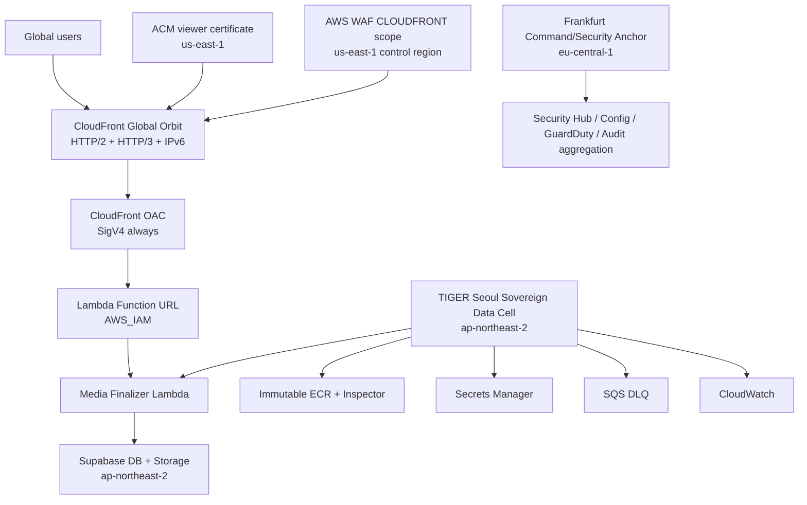

# TIGER SOVEREIGN CONSTELLATION 2026 — Master Architecture Specification

Date: 2026-08-28
Base authority: protected `main`
Implementation branch: `feat/tiger-sovereign-constellation-2026-20260828`
Status: **OWNER APPROVED — MASTER ARCHITECTURE AUTHORITY**

## 1. Supreme decision

TIGER adopts **TIGER SOVEREIGN CONSTELLATION 2026** as the single current architecture authority for the Sealed Media Cell and its global deployment path.

This specification supersedes every unexecuted or unmerged design that conflicts with it, including:

- a Frankfurt-only Media Finalizer runtime;
- a `us-east-1` Media runtime bootstrap;
- the combined single CloudFormation stack that owns ECR/Lambda/CloudFront/WAF together;
- fabricated first-release canary baselines;
- public or unauthenticated Lambda Function URL fallback paths;
- standing AWS access keys for GitHub automation.

No compatibility fallback to a superseded architecture is permitted.

## 2. Architecture thesis

TIGER is a global platform, but global reach does not require every stateful component to run in every AWS Region. The architecture separates four authorities:

1. **Global Orbit** — CloudFront global ingress and delivery.
2. **Sovereign Data Cell** — trusted compute placed beside the authoritative hot data plane.
3. **Command/Security Anchor** — governance, evidence aggregation, security administration, and future European expansion authority.
4. **Cryptographic Genome** — immutable identity for each released artifact and deployment state.

The first active Data Cell is **Seoul `ap-northeast-2`** because the live Supabase project and Storage authority are currently in `ap-northeast-2`. The first Command/Security Anchor is **Frankfurt `eu-central-1`**. CloudFront-scoped WAF and CloudFront viewer certificate authority use **`us-east-1` where AWS requires it**.

Frankfurt is not removed from the platform strategy. It is deliberately kept off the current media hot path until TIGER either migrates the authoritative Supabase data plane to Europe or activates a separately proven European Sovereign Cell.

## 3. Canonical topology



CloudFront is the only public Production ingress for the Media Finalizer. Direct Function URL bypass must fail.

## 4. Sovereign Cell contract

Every future TIGER Sovereign Cell must implement the same bounded contract:

- regional immutable ECR;
- Lambda runtime by immutable OCI digest;
- Secrets Manager references;
- encrypted SQS/DLQ;
- CloudWatch logs, metrics and alarms;
- KMS keys where customer-managed control is required;
- least-privilege runtime IAM role;
- regional CloudFormation stack;
- bounded security and deployment evidence;
- no direct public origin fallback.

A future Cell is not activated until the **Three-Lock Region Doctrine** passes:

### 4.1 Data Gravity Lock

The trusted compute is colocated with the authoritative DB/Storage path unless an independently measured architecture proves a better tradeoff.

### 4.2 Residency Lock

Country, contractual, regulatory, or sovereignty requirements are explicitly mapped before regional activation.

### 4.3 Evidence Lock

Measured p95/p99 latency, availability, traffic concentration, recovery, or legal requirements must justify the extra distributed-system complexity.

Failure of any lock means the Cell remains inactive.

## 5. Region authority

### 5.1 Seoul — first active Data Cell

`ap-northeast-2` owns the first Production Media runtime:

- ECR;
- Lambda;
- Secrets Manager;
- SQS DLQ;
- CloudWatch runtime telemetry;
- regional runtime CloudFormation;
- regional KMS keys as specified;
- regional build/deploy IAM resource scopes.

This placement follows the live Supabase DB and Storage authority in the same region.

### 5.2 Frankfurt — Command/Security Anchor

`eu-central-1` is TIGER's first Command/Security Anchor and future European Sovereign Cell authority. It may host governance-supporting regional services where their service model and aggregation semantics support it.

The Command Anchor must never be interpreted as permission to route the current media hot path through Frankfurt while its authoritative data remains in Seoul.

### 5.3 us-east-1 — Global Edge control requirements only

`us-east-1` is used only where CloudFront integration requires or benefits from it, especially:

- CloudFront-scoped AWS WAF authority;
- ACM certificate for CloudFront custom viewer domain;
- explicitly documented global-edge control resources.

It is not the default TIGER Media runtime region.

## 6. Global Orbit

Production CloudFront must use:

- TIGER custom production domain;
- ACM certificate in `us-east-1`;
- SNI-only certificate delivery;
- minimum viewer security policy `TLSv1.2_2025` or a later reviewed equivalent;
- HTTP/2 and HTTP/3;
- IPv6;
- HTTPS-only viewer policy;
- `PriceClass_All` for global reach unless a later measured owner-approved cost policy intentionally narrows it;
- no caching for authenticated Media Finalizer POST responses;
- CloudFront OAC with SigV4 `always` signing to the Lambda Function URL;
- Lambda Function URL `AWS_IAM` authentication;
- no public direct-origin fallback.

The existing `CloudFrontDefaultCertificate` and `PriceClass_100` deployment shape is not Production-authoritative under this specification.

## 7. WAF and abuse protection

The Global Orbit uses layered controls:

- explicit allowed-method contract;
- body-size ceiling with fail-closed oversize behavior;
- expected content-type enforcement where safely expressible;
- AWS Managed Common Rule baseline;
- AWS Known Bad Inputs where compatible with the endpoint contract;
- Amazon IP reputation controls;
- bounded IP rate limits;
- application-level quotas based on authenticated principal/job/capability, not IP alone;
- abuse/anomaly metrics;
- no claim that WAF, CORS, Origin, or IP identity substitutes for user authentication.

Paid advanced WAF features such as Bot Control or ATP are added only after measured abuse evidence justifies cost and complexity.

## 8. Zero-Trust identity fabric

Every Media Finalizer request remains fail-closed through independent locks:

1. CloudFront origin authority;
2. Function URL `AWS_IAM`;
3. exact request-body `x-amz-content-sha256` contract;
4. valid Clerk JWT signature;
5. exact allowed algorithm;
6. exact issuer;
7. exact audience;
8. exact authorized-party/`azp` policy;
9. valid `exp`;
10. valid `nbf` with bounded clock skew;
11. valid subject;
12. one-time media capability;
13. DB claim/replay lease;
14. JWT subject equals trusted job/media owner subject;
15. bounded retry/attempt rules.

Browser authority is never canonical authority. Browser clients may request finalization, but only the trusted server-side finalizer and protected DB RPCs can establish canonical media state.

## 9. Supabase convergence gate

The live Supabase project is part of the Production release authority. AWS cannot be GREEN while the required DB contract is absent.

Before Production activation, the Media Finalizer DB migrations must be applied through the protected migration path and then verified live for:

- `vvip_media_finalization_jobs` contract;
- request/claim/complete/fail RPCs;
- `service_role`-only trusted claim/complete/fail execution;
- authenticated request RPC only where explicitly intended;
- owner binding;
- hashed one-time capability storage;
- lease/replay protection;
- canonical-field write protection;
- private raw media storage;
- canonical publication rules;
- proof-capture finalization RPC contract;
- RLS and Storage policy correctness.

Supabase security/performance advisor findings are never silently ignored. Every WARN relevant to a release is classified as exactly one of:

- `FIXED`;
- `INTENTIONAL_AND_TESTED`;
- `NOT_APPLICABLE_WITH_EVIDENCE`.

## 10. AWS account isolation target

TIGER's target-state AWS landing zone is multi-account:

```text
AWS Organization
├── Management / Identity
├── Security / Audit
├── Log Archive
├── Production
└── Non-Production / Staging
```

Principles:

- no Production workload in the Management account after landing-zone convergence;
- Identity Center for human access;
- no daily root usage;
- no IAM users for routine administration;
- no root access keys;
- short-lived sessions and MFA/passkey controls;
- centralized immutable audit evidence;
- phased migration so account separation does not create a fake launch gate before the architecture and roles are ready.

## 11. GitHub OIDC 2026 authority

GitHub-to-AWS automation uses OIDC only. No AWS access key or secret access key is stored in GitHub.

Trust policy must use the strongest available immutable identity claims supported by the repository and AWS integration, including stable repository/owner IDs and protected environment/workflow binding. The migration to immutable subject claims must be performed fail-closed and tested before removing the legacy compatible trust condition.

Build, regional deploy, and edge deploy use separate roles and separate protected GitHub Environments.

## 12. IAM role separation

At minimum:

### 12.1 MediaBuildRole

May:

- authenticate to ECR;
- describe the exact Media repository;
- push image layers/manifests;
- read scan findings required by the build gate.

May not mutate Lambda, CloudFormation, IAM, WAF, CloudFront, Secrets values, or unrelated ECR repositories.

### 12.2 RegionalDeployRole

May create/review/execute only the allowed regional CloudFormation change sets and pass only the exact regional CloudFormation service role.

### 12.3 EdgeDeployRole

May create/review/execute only the allowed Global Edge CloudFormation change sets and pass only the exact edge CloudFormation service role.

### 12.4 CloudFormation service roles

Regional and Edge service roles are separate and have permissions boundaries. `iam:PassRole` is restricted to exact approved roles.

The existing `TIGER-VVIP-GitHub-ProductionDeploy` role remains untouched until an explicit reviewed convergence task replaces its identity-proof purpose.

## 13. Infrastructure authority split

The combined `infra/media-finalizer/template.yaml` shape is historical implementation input, not the final deployment authority.

The implementation converges to focused stacks:

1. account/security baseline;
2. media build foundation;
3. Seoul regional runtime;
4. global edge;
5. observability/security evidence.

A resource has one authoritative CloudFormation owner. No two stacks may independently create or mutate the same long-lived resource.

## 14. ECR and container security

The first authoritative Media repository is private and regional in `ap-northeast-2`.

Required properties:

- immutable tags;
- deployment by OCI digest, never tag authority;
- customer-managed KMS encryption for the final Production repository unless a reviewed compatibility constraint proves it impossible;
- lifecycle retention policy;
- no public repository policy;
- Amazon Inspector enhanced/continuous container scanning;
- critical/high deployment-blocking policy unless a time-bounded owner/security exception includes evidence and expiry.

The Production repository is created once under its final encryption authority because repository encryption configuration is not treated as an afterthought.

## 15. Build-once supply-chain contract

The Sealed Build is deterministic in identity even where byte-for-byte Docker reproducibility is not claimed.

Requirements:

- exact protected `main` SHA;
- exact Git tree SHA;
- Node.js 24 LTS;
- pinned Lambda base image by OCI SHA256 digest;
- `package-lock.json` authority;
- `npm ci`;
- pinned GitHub Actions by full commit SHA;
- build once;
- push once;
- resolve immutable OCI manifest digest;
- deploy exactly that digest;
- no image rebuild between test and Production.

## 16. Cryptographic Genome

Every eligible release receives a **TIGER Cryptographic Genome** containing or binding:

- Git commit SHA;
- Git tree SHA;
- base image digest;
- final OCI image digest;
- dependency lock digest;
- Dockerfile digest;
- infrastructure template/policy digests;
- DB migration digests relevant to the release;
- real container SBOM digest;
- provenance attestation identity;
- SBOM attestation identity.

Changing any authoritative material changes the Genome identity.

## 17. Real SBOM requirement

The existing materials-oriented CycloneDX document is retained as useful build-material evidence but is not sufficient by itself as the Production container SBOM.

The final build must generate a real OCI/container inventory after the immutable image digest exists and bind it to that digest. The real SBOM must:

- use CycloneDX 1.7 or later explicitly reviewed compatible version;
- include runtime OS/package and application dependency inventory available from the built image;
- be stored as bounded release evidence;
- be attested to the exact OCI digest;
- be verified before deployment eligibility.

No unsupported SLSA level is claimed. SLSA claims require explicit evidence that the builder and provenance meet the claimed level.

## 18. Vulnerability gate

Default deployment policy:

- `CRITICAL` -> BLOCK;
- `HIGH` -> BLOCK;
- `MEDIUM` -> evaluate under owner/security policy;
- `LOW` -> record and monitor.

Any exception must contain:

- CVE/advisory identity;
- affected component;
- exploitability/reachability rationale;
- owner/security approval;
- explicit expiry;
- VEX evidence where applicable;
- automatic re-evaluation trigger.

## 19. Runtime sizing discipline

Initial safety values may use:

- memory 2048 MB;
- timeout 30 seconds;
- reserved concurrency 8;
- x86_64 while canonical byte identity is proven.

These are bootstrap values, not permanent global scaling constants.

Before scaling, benchmark representative JPEG/WebP fixtures across candidate memory sizes and architectures. A runtime architecture change is rejected if it unexpectedly changes canonical output bytes, metadata, dimensions, policy behavior, or failure semantics.

Provisioned Concurrency is enabled only if measured cold-start impact justifies it.

## 20. Privacy-preserving telemetry

Logs and evidence may contain:

- request/correlation ID;
- Genome/release ID;
- region;
- Lambda version;
- duration;
- response/status class;
- bounded error/failure class;
- byte-size class;
- WAF decision;
- alarm/security state.

Logs and evidence must never contain:

- JWTs;
- `x-tiger-session`;
- media capability tokens;
- Supabase privileged secret;
- authorization headers;
- raw request bodies;
- raw media;
- signed storage URLs;
- secret values.

CloudFront/WAF logging uses minimum necessary fields, redaction, bounded retention, and encrypted central storage.

## 21. Security Constellation

Production security posture includes, phased according to account readiness:

- GuardDuty and Lambda Protection;
- Amazon Inspector;
- Security Hub CSPM;
- AWS Config;
- IAM Access Analyzer;
- multi-region CloudTrail;
- centralized audit/log archive;
- CloudWatch alarms;
- WAF telemetry;
- GitHub CodeQL, Dependency Review, secret scanning/push protection, CleanGuard and Zero-Residue gates;
- Supabase advisors and DB security rehearsal.

TIGER exposes an operational security state:

- `GREEN`;
- `DEGRADED`;
- `RED`;
- `LOCKDOWN`.

No state is reported GREEN without its required evidence.

## 22. Sovereign Lockdown design

A reviewed emergency lockdown procedure must be able to:

- freeze Production deployments;
- revoke or disable deployment OIDC authority without destroying diagnostic access;
- block risky Global Edge paths;
- preserve the known-stable immutable runtime;
- preserve CloudTrail/security evidence;
- prevent unreviewed secret mutation;
- keep read-only diagnostics available to the security operator.

Lockdown itself is protected by independent authority so it cannot become an easy denial-of-service mechanism.

## 23. First release — Dark Bootstrap

There is no legitimate prior Media Lambda stable version today. The first release therefore uses `dark-bootstrap`.

Sequence:

1. repository exact-head gates GREEN;
2. protected Supabase migration rehearsal GREEN;
3. required DB migrations applied and verified live;
4. Sealed Build GREEN;
5. exact immutable OCI digest resolved;
6. real SBOM + Inspector scan + attestations verified;
7. Seoul regional runtime stack `CREATE` via reviewed change set;
8. first immutable Lambda version published;
9. Global Edge stack `CREATE` via reviewed change set;
10. custom-domain/TLS/WAF/OAC endpoint becomes technically reachable but remains absent from public TIGER browser runtime configuration;
11. direct Function URL bypass probe must fail;
12. deterministic positive/negative/abuse probes execute through real CloudFront;
13. named alarms/security state must be acceptable;
14. first version becomes stable baseline;
15. only then may the verified CloudFront endpoint become eligible for `TIGER_MEDIA_FINALIZER_URL` convergence.

Dark Bootstrap is never represented as a weighted canary.

## 24. Shadow Verification

Before a risky candidate receives user traffic, a deterministic candidate smoke/shadow gate compares stable expectations with candidate behavior using isolated fixtures.

For media transformations it records and compares at minimum:

- canonical SHA256;
- MIME;
- dimensions;
- canonical byte size;
- expected policy decisions;
- RPC success/failure contract;
- latency envelope.

Shadow verification never duplicates a user's mutating Production request into a second writer. It uses purpose-built isolated fixtures or read-safe deterministic comparison paths.

## 25. Adaptive Progressive Canary

After a real stable baseline exists, releases use risk-based progressive traffic.

Allowed policy examples:

- low-risk: deterministic smoke -> 10% -> 100%;
- medium-risk: deterministic smoke -> 5% -> 10% -> 25% -> 100%;
- high-risk identity/media changes: deterministic smoke -> 1% -> 5% -> 10% -> 25% -> 50% -> 100%.

Every stage requires bounded observation and explicit alarm/error/security gates. Weighted Lambda routing is not treated as deterministic test selection; candidate-specific smoke verification occurs before weighted user traffic.

## 26. Rollback contract

Before deployment, evidence records:

- prior OCI digest;
- prior release/Genome identity;
- prior Lambda stable version;
- prior alias routing state;
- prior regional stack parameters/state;
- prior edge stack state;
- relevant change-set IDs.

Any failed release gate stops progression and restores the last verified stable authority. Rollback must be independently probed through CloudFront and recorded in release evidence.

Rollback never re-enables a superseded public/unauthenticated runtime path.

## 27. Phoenix Protocol — tested disaster recovery

TIGER does not claim DR readiness from documentation alone.

A periodic Phoenix rehearsal must prove that a clean environment can be recreated from authoritative infrastructure and immutable release evidence:

1. provision bounded fresh environment;
2. restore infrastructure from reviewed IaC;
3. restore secret references without exporting secret values;
4. deploy an exact previously verified OCI digest;
5. verify DB/storage contracts;
6. restore edge ingress;
7. run positive/negative/security probes;
8. record measured RTO/RPO evidence.

## 28. Cost Governor

Operational safety includes financial containment:

- AWS Budgets;
- Cost Anomaly Detection;
- Service Quotas monitoring;
- Lambda concurrency envelopes;
- WAF rate controls;
- bounded log retention;
- ECR lifecycle rules;
- anomaly evidence review.

Budget thresholds do not automatically destroy or disable Production. Financial alerts feed operator decisions unless an explicitly reviewed safe-control policy says otherwise.

## 29. GitHub governance

Production-authoritative repository controls include:

- protected `main`;
- exact-head required checks;
- review requirements;
- CODEOWNERS for infrastructure/security/workflows where repository governance supports it;
- protected GitHub Environments;
- OIDC-only AWS access;
- CodeQL;
- Dependency Review;
- secret scanning/push protection;
- TIGER CleanGuard;
- Zero-Residue full-history policy;
- no unreviewed direct `main` mutation.

## 30. Release Passport 2.0

The Cryptographic Release Passport binds the Genome to deployment evidence and records bounded non-secret identifiers/statuses including:

- Git commit/tree;
- OCI/base-image digest;
- real SBOM digest;
- runtime region;
- Global Edge control region;
- AWS account identity for each deployed authority;
- KMS key IDs/ARNs where applicable;
- ECR repository identity;
- Inspector scan state;
- provenance/SBOM attestation verification;
- DB migration set/hash and live verification state;
- regional stack/change set;
- edge stack/change set;
- Lambda version;
- CloudFront distribution;
- WAF WebACL;
- deployment mode;
- canary stage history when applicable;
- runtime probe digest;
- alarm/security-state digest;
- rollback evidence when exercised.

It never contains secrets, JWTs, capabilities, raw media, request bodies, authorization headers, or signed URLs.

## 31. Explicit non-goals until evidence requires them

Do not add merely for architectural appearance:

- EKS/Kubernetes;
- service mesh;
- Redis;
- RabbitMQ;
- API Gateway without a concrete contract advantage;
- active-active multi-region writes;
- permanent Provisioned Concurrency;
- Shield Advanced without threat/SLA justification;
- VPC attachment solely to look enterprise;
- multi-region state replication without conflict/state authority design.

YAGNI applies to infrastructure as strongly as application code.

## 32. Implementation order

The implementation proceeds in this order:

1. repository contracts/tests for the new architecture;
2. split IaC and Guard policy;
3. foundation/IAM templates and policies;
4. real SBOM/Genome/Passport tooling;
5. Sealed Build workflow update;
6. DB convergence gates;
7. Dark Bootstrap-aware regional deploy workflow;
8. Global Edge deploy workflow;
9. shadow/adaptive-canary controller contracts;
10. observability/security evidence;
11. exact-head CI verification and reviewed PR;
12. AWS bootstrap only after repository gates are GREEN;
13. live Supabase convergence;
14. live Sealed Build;
15. live Dark Bootstrap;
16. Production endpoint convergence only after complete runtime evidence.

## 33. Production readiness definition

TIGER Media is **not Production-ready** until actual live evidence proves all required authorities:

- repository exact-head GREEN;
- Supabase migration contract live and verified;
- ECR/Inspector/KMS authority live;
- Sealed Build successful on exact release SHA;
- OCI digest and real SBOM attested and verified;
- regional stack deployed;
- Global Edge stack deployed;
- custom TLS endpoint verified;
- WAF/OAC/direct-origin-denial verified;
- runtime and abuse probes GREEN;
- CloudWatch/security gate acceptable;
- Dark Bootstrap or applicable progressive canary completed;
- rollback authority known and tested to the required level;
- release passport complete.

No documentation, rehearsal, branch check, or successful PR by itself is evidence of Production deployment.

## 34. Current live-state truth at adoption

At adoption time:

- merged `main` contains the prior Sealed Media Cell implementation;
- the prior Sealed Build attempt failed before AWS authentication because its AWS region/repository/build-role variables were empty;
- the live AWS inspection showed no ECR repositories in `us-east-1`;
- the live AWS inspection showed no completed CloudFormation stacks in `us-east-1` among the queried completed statuses;
- the GitHub OIDC provider exists;
- the existing `TIGER-VVIP-GitHub-ProductionDeploy` role has zero attached and zero inline policies;
- no Media Build role was created by the abandoned `us-east-1` bootstrap instructions;
- the live Supabase project is ACTIVE_HEALTHY in `ap-northeast-2`;
- the required Media Finalizer production DB RPC/table convergence is not yet live;
- Production E2E is therefore not proven.

## 35. Owner authority

This document is the detailed implementation authority underneath the owner's concise reference file:

`docs/owner-reference/TIGER-SOVEREIGN-CONSTELLATION-2026.md`

If a future implementation conflicts with this Master Spec, it requires an explicit new owner-approved architecture revision. Silent fallback to an older design is forbidden.
